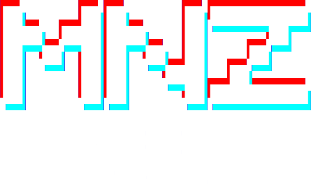

<!-- Banner -->
<p align="center">
  
</p>

<h1 align="center">MNZone – Centro E‑Sports & Gaming en Granada 🕹️</h1>
<p align="center">
  Proyecto de Fin de Grado Superior en Desarrollo de Aplicaciones Web.<br>
  Plataforma full‑stack para la gestión integral de un local gaming: reservas, tienda, noticias, administración y más.
</p>

<p align="center">
  <a href="https://img.shields.io/badge/PHP-8.2-blue"> </a>
  <a href="https://img.shields.io/badge/MySQL-MariaDB-orange"> </a>
  <a href="https://img.shields.io/badge/License-MIT-green"> </a>
  <a href="https://img.shields.io/github/languages/top/JaimeMGR/MNZone"> </a>
</p>

---

## ✨ Tabla de contenidos
1. [Demo en vivo](#-demo-en-vivo)
2. [Características](#-características-principales)
3. [Stack tecnológico](#-stack-tecnológico)
4. [Estructura del repositorio](#-estructura-del-repositorio)
5. [Modelo de datos](#-modelo-de-datos)
6. [Instalación rápida](#-instalación-rápida)
7. [Uso diario](#-uso-diario)
8. [Contribuir](#-contribuir)
9. [Roadmap](#-roadmap)
10. [Licencia](#-licencia)

---

## 🚀 Características principales
| Módulo | ¿Qué hace? |
|--------|------------|
| **Inicio** | Landing con *slider* de noticias dinámicas, tabla de precios y testimonios de socios. :contentReference[oaicite:0]{index=0} |
| **Noticias** | CRUD de artículos con editor WYSIWYG e imágenes. |
| **Reservas** | Calendario interactivo, control de disponibilidad y estados (`pendiente`, `aceptada`, `cancelada`). |
| **Tienda** | Carrito temporizado: productos físicos y “packs de tiempo” para salas, PS5 o simulador. |
| **Servicios & Equipos** | Catálogo autogestionable de salas y hardware gaming (PC Gamer, simulador racing, etc.). |
| **Socios / Roles** | Autenticación con hashing `bcrypt`; roles `admin` y `socio` para proteger rutas. |
| **Panel de control** | Estadísticas de uso (segundos por sala), testimonios y gestor de reservas. |
| **Contacto** | Formulario que almacena mensajes en DB y envía notificación por correo. |

---

## 🛠️ Stack tecnológico
| Capa | Tecnologías |
|------|-------------|
| **Frontend** | HTML5, CSS3, Bootstrap 5, JavaScript ES6 |
| **Backend** | PHP 8.2 (estilo procedural + MySQLi preparados) |
| **Base de datos** | MariaDB 10.4 (`mnzone_db`) |
| **Dependencias** | Composer (PHPMailer, Dotenv, Dompdf, etc.) |
| **Scripts extra** | Automatizaciones en Python (carpeta `python/`) |
| **Stats** | 67 % PHP, 13 % CSS, 10 % JS, 9 % Python :contentReference[oaicite:1]{index=1} |

---

## 🗂️ Estructura del repositorio
```

├── css/           # Hojas de estilo y utilidades
├── js/            # Scripts vanilla JS
├── php/           # Endpoints AJAX / submódulos PHP
├── python/        # Herramientas y tareas batch
├── imagenes/      # Recursos multimedia
├── vendor/        # Librerías instaladas vía Composer
├── index.php      # Landing (punto de entrada)
├── utilidades.php # Funciones comunes (DB, sesiones, helpers)
└── mnzone\_db.sql  # Script de creación y datos de ejemplo

````

---

## 🗄️ Modelo de datos
El proyecto se apoya en **13 tablas** que cubren reservas, socios, tienda, testimonios, etc.  
Las principales:

| Tabla | Propósito rápido |
|-------|------------------|
| `socio` | Usuarios y roles |
| `servicio` | Salas y experiencias ofertadas |
| `productos` | Packs de tiempo y snacks |
| `reservas` | Turnos reservados/consumidos |
| `registros_uso` & `tiempos_sala` | Métricas de tiempo efectivamente usado |
| `noticia`, `testimonio` | Marketing y feedback |
| ... | (Consulta `mnzone_db.sql` para verlas todas)  |

> **Tip:** Puedes importar el dump con  
> `mysql -u root -p mnzone_db < mnzone_db.sql`.

---

## ⚡ Instalación rápida
```bash
# 1. Clona el proyecto
git clone https://github.com/JaimeMGR/MNZone.git
cd MNZone

# 2. Instala dependencias PHP
composer install

# 3. Crea la base de datos
mysql -u root -p < mnzone_db.sql

# 4. Configura credenciales
cp .env.example .env      # (o edita utilidades.php)
# DB_HOST, DB_USER, DB_PASS, DB_NAME

# 5. Arranca servidor local
php -S localhost:8000
````

> Visita `http://localhost:8000` y prueba a entrar con el usuario demo:
> **Usuario**: `Admin` · **Contraseña**: `admin123` (cámbiala después).

---

## 🧑‍💻 Uso diario

| Rol     | Puede…                                                          |
| ------- | --------------------------------------------------------------- |
| `socio` | Reservar, añadir testimonios, ver consumos                      |
| `admin` | Gestionar socios, noticias, servicios, tienda, aceptar reservas |

---
